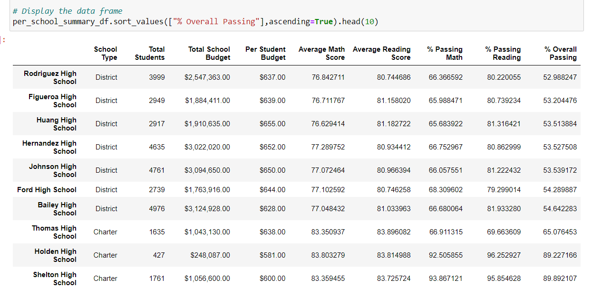

# School_District_Analysis
using python

## Overview of the school district analysis
The school board would like to verify the validity of reading and math grades for Thomas High School ninth graders.
### Purpose
The purpose of this project is to:
  1. replace the math and reading scores for ninth graders in Thomas High School with NaNs while keeping the rest of the data intact.
  2. analyze the math and reading scores for all school districs

## Results
### Affects on District Summary After Changes

As shown below, *-% Passing Math*-, *-% Passing Reading*- and *-%Overall Passing*- for District Summary have slightly fallen by roughly 0.1% after replacing the original scores with NaNs for Thomas High School (THS)

**District Summary Including THS Ninth graders' original scores**

**District Summary Replacing THS Ninth graders' scores to Nans**

### Affects on School Summary After Changes

When replacing ninth grader's math and reading scores with Nans, Thomas high school went to bottom 8 and passing rates have significantly fallen by more than 30%
However, if we exclude ninth graders and their scores, Thomas High School is remain at Top 2 and the passing rates only slightly fallen

**School Summary Replacing THS ninth graders' scores with Nans**

**School Summary Excluding THS ninth graders and their scores**

How does replacing the ninth-grade scores affect the following:

Math and reading scores by grade
Scores by school spending
Scores by school size
Scores by school type

## Summary 
There is a statement summarizing four changes to the school district analysis after reading and math scores have been replaced
