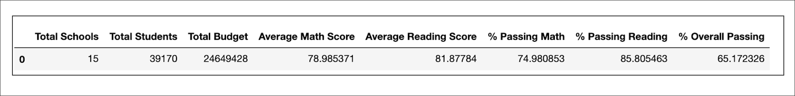

# School_District_Analysis
  
## Overview of the school district analysis
The school board would like to verify the validity of reading and math grades for Thomas High School ninth graders.
### Purpose
The purpose of this project is to:
  1. Replace the math and reading scores for ninth graders in Thomas High School with NaNs while keeping the rest of the data intact.
  2. Analyze the math and reading scores for all school districts

## Results
### 1. Change Effect District Summary 

:point_right: As shown below, *-% Passing Math*-, *-% Passing Reading*- and *-%Overall Passing*- for District Summary have slightly fallen after replacing the original scores with NaNs for Thomas High School (THS) with **no huge changes on overall data**.

**District Summary Including THS Ninth graders' original scores**



**District Summary Replacing THS Ninth graders' scores to Nans**


### 2. Change Effect on Overall School Summary & Thomas High School Relative Performance

:point_right: When replacing ninth grader's math and reading scores with Nans, Thomas high school (THS) fell out of Top 2 and passing rates have significantly fallen by 25% from 90.94% to 65.07%.
However, if we exclude ninth graders and their scores, Thomas High School remains at Top 2 with an overall passing rates changes 0.3% from 90.94% of 90.63%.

**Original School Summary**


**Updated School Summary 1 (Replacing THS ninth graders' scores with Nans)**


**Updated School Summary 2 (Excluding THS ninth graders)**


### 3. Overall Change Effect on replacing THS ninth grade score

**Math scores by grade**

:point_right:Except THS ninth grade math score changed to NaN, there is **no huge impact** on the rest of the data


**Reading scores by grade**

:point_right:Except THS ninth grade reading score changed to NaN, there is **no huge impact** on the rest of the data


**Scores by school spending**

:point_right: There is **no huge impact** after replacing THS ninth grader score

*-Before*-


*-After*-


**Scores by School Size**

:point_right: After replacing THS ninth grader score, the **%Overall passing**  for medium size schools has slightly **decreased by 0.06%**

*-Before*-


*-After*-


**Scores by School Type**

:point_right:After replacing THS ninth grader score, the **%Overall passing** for charter type has slightly **decreased by 0.04%**

*-Before*-


*-After*-


## Summary 
To sum up, below is the conclusion on how replacing THS ninth grade scores have impacted different measurements:

```
  1. District Analysis : no huge impact 
  2. Top School Ranking : no huge impact
  3. Scores by School Spending : no huge impact
  4. Scores by School Size : the %Overall passing for medium size schools has slightly decreased by 0.06%
  5. Scores by School Type : the %Overall passing for charter  type has slightly decreased by 0.04%

```

### Resources
  - Data Sources : schools_complete.csv & students_complete.csv
  - Library : Pandas & Numpy
  - Language : Python
  - Application : Jupyter Notebook
